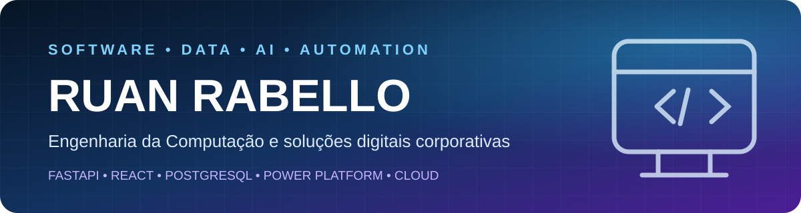

 1 file changed, 1 insertion(+), 1 deletion(-)

  

  <strong>Back-end · Dados · Inteligência Artificial · Automação · Cloud</strong>

## Sobre mim

Sou estudante de **Engenharia da Computação** e atuo em **IT Digital Delivery**, desenvolvendo e apoiando soluções corporativas. Meu foco está em APIs, integrações, assistentes de IA, dados e automação de processos.

  
  

## Tecnologias

| Área | Tecnologias |
|---|---|
| Back-end | Python, FastAPI, APIs REST, SQLAlchemy |
| Dados | SQL, PostgreSQL, Supabase, Excel, Power BI |
| IA | LangChain, Ollama, Gemini, Grok, Machine Learning |
| Front-end | React, TypeScript, JavaScript, HTML e CSS |
| Automação | Power Automate, VBA, Python e Power Apps |
| Cloud e Enterprise | AWS, Azure, Oracle Cloud, SAP S/4HANA e OData |

## Projetos em destaque

| Projeto | O que demonstra | Stack principal |
|---|---|---|
| [Enterprise AI Assistant](https://github.com/Ruanrabello/enterprise-ai-assistant) | Plataforma corporativa de IA, histórico de conversas e múltiplos providers | FastAPI, React, TypeScript, PostgreSQL |
| [Projects](https://github.com/Ruanrabello/Projects) | Catálogo de aplicações, estudos e experimentos técnicos | Python, APIs, Dados, Machine Learning |
| [Excel VBA Automation](https://github.com/Ruanrabello/Excel-vba-projects) | Automação de relatórios, dados, PDFs, gráficos e Outlook | Excel, VBA, Automação |

## Formação e certificações

- Engenharia da Computação — em andamento
- Oracle Cloud Infrastructure Foundations e AI Foundations
- Oracle Data Platform Foundations
- Cisco Python Essentials
- Estudos direcionados para AWS Cloud Practitioner e Microsoft Azure

## Experiência atual

Atuação em **IT Digital Delivery Back**, com contato com SAP S/4HANA, SAP Fiori, integrações OData, Power Platform e soluções digitais corporativas.

## Atualmente

- Desenvolvendo o Enterprise AI Assistant
- Aprofundando conhecimentos em Back-end, Cloud e IA aplicada
- Trabalhando com integrações, automação e soluções corporativas

---

  <strong>Rio de Janeiro, Brasil</strong> 
  Aberto a conexões, colaboração e oportunidades em tecnologia.

